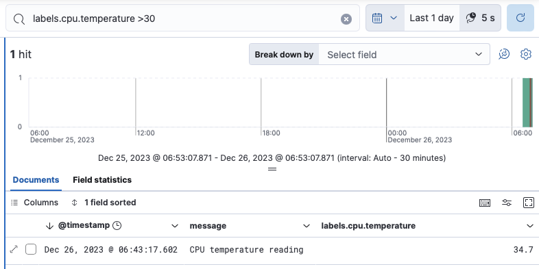
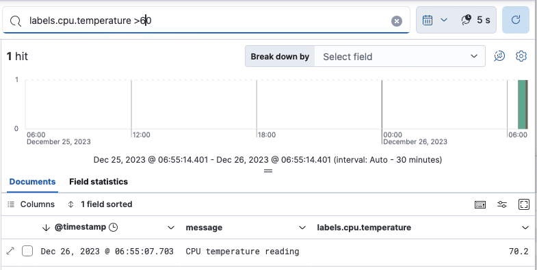

# SwiftEcsLogger

> [!CAUTION]
> This is a new package and is likely to either iterate quickly to a `1.0.0` release or whither and die.


## What?

`SwiftEcsLogger`is a simplified logger for server-side or command-line Swift applications.  

## Why?

Perhaps the functionality already exists in another package, but every logger I looked at had emojis and unnecessary complexity.  Furthermore, they didn't (seem to) have a straightforward manner to generate ECS-compatible logs suitable for ingesting into Elasticsearch.

## How?

### Adding to `Package.swift`

Add the following to your `Package.swift` top-level dependencies:
```swift
    dependencies: [
      .package(url:  "https://github.com/iachievedit/swiftecslogger", from:"0.0.1"),
    ],
```

And then, for any target you want to link to the package:
```swift
    targets: [
        .executableTarget( name: "<yourtarget>", dependencies: [
          .product(name: "SwiftEcsLogger", package: "SwiftEcsLogger")
        ])
    ]
```

### Adding to Application

```swift
import SwiftEcsLogger

let logger = EcsLogger(logFilePath:  "yourtarget.log")
```

### Simple Message Logging

```swift
logger.log(level:  .info, message:  "Log, log, it's big, it's heavy, it's wood")
```

### Logging Labels

Structured logging takes logging to a whole new level.  Let's say we're developing an application which reads and logs the CPU temperature at a given time.  We could log it like:

```swift
logger.log(level: .info, message:  "The current CPU temperature is \(cpuTemperature)")
```

This works, but, consider the individual that is looking for CPU temperatures above 60 degrees Celsius.  That'd be a lot easier if we could use Kibana to search for it.  Structured logging can help:

```swift
struct CpuTemperature : Codable {
  let temperature:Double
  var unit:String = "Celsius"

  enum CodingKeys:  String, CodingKey {
    case temperature = "cpu.temperature"
    case unit        = "temperature.unit"
  }
}

let reading  = CpuTemperature(temperature:  34.7)
logger.log(level:  .info,
           message:  "CPU temperature reading",
           logData: reading)

logger.log(level: .warn,
           message: "CPU temperature reading",
           logData: CpuTemperature(temperature: 70.2))
```

The `EcsLogger` object takes any data supplied as `logData` and
uses a `JSONEncoder` to encode it into a JSON object with a key of `labels`.  The two logs emitted in JSON appear as:

```json
{
  "log.level": "info",
  "ecs.version": "1.12.2",
  "@timestamp": "2023-12-26T12:55:02Z",
  "message": "CPU temperature reading",
  "labels": {
    "temperature.unit": "Celsius",
    "cpu.temperature": 34.7
  }
}
{
  "labels": {
    "temperature.unit": "Celsius",
    "cpu.temperature": 70.2
  },
  "log.level": "warn",
  "ecs.version": "1.12.2",
  "message": "CPU temperature reading",
  "@timestamp": "2023-12-26T12:55:02Z"
}
```

Note:  You have to bring your own `CodingKeys` enum if you want the encoding of the keys to be different from the declared struct properties.  In this example we use `cpu.temperature` instead of `temperature`, and likewise, `temperature.unit` instead `unit`.

Now that our log data is structured, we can use Kibana and Kibana Query Language (KQL) to find CPU temperature readings.



And for greater than 60 Celsius:



This is all possible because we made the conscious decision to _structure_ our logs.
